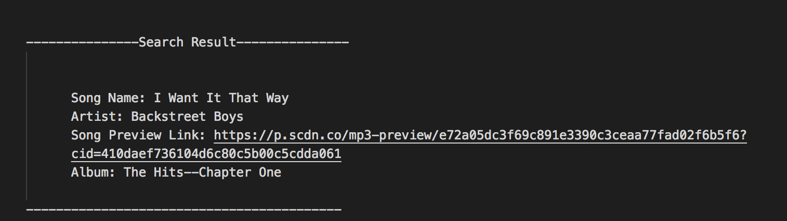

# liri-node-app


LIRI BOT

LIRI is like iPhone's SIRI. However, while SIRI is a Speech Interpretation and Recognition Interface, LIRI is a Language Interpretation and Recognition Interface. LIRI will be a command line node app that takes in parameters and gives you back data.

LIRI bot will run four functions when prompted. You will be able to search for a song within the Spotify API ('spotify-this-song), for movies on OMBD API ('movie-this') and for concerts using the Bands In Town API. 

;

#commands:

node liri.js concert-this <artist/band name here>

```
This will search the Bands in Town Artist Events API ("https://rest.bandsintown.com/artists/" + artist + "/events?app_id=codingbootcamp") for an artist and render the following information about each event to the terminal:

    Venue Name

    Venue location

    Event Date (with the format "MM/DD/YYYY" incorporated by moment)
```

node liri.js spotify-this-song <name of song>

```

This will show the following information about the song in your terminal/bash window

Artist(s)

The song's name

A preview link of the song from Spotify

The album that the song is from

```

node liri.js movie-this <name of movie>
```

This will output the following information to your terminal/bash window:

   * Title of the movie.
   * Year the movie came out.
   * IMDB Rating of the movie.
   * Rotten Tomatoes Rating of the movie.
   * Country where the movie was produced.
   * Language of the movie.
   * Plot of the movie.
   * Actors in the movie.

If the user doesn't type a movie in, the program will output data for the movie 'Mr. Nobody.'

```

node liri.js do-what-it-says

```

Using the fs Node package, LIRI will take the text inside of random.txt and then use it to call one of LIRI's commands.

It should run spotify-this-song for "I Want it That Way," as follows the text in random.txt. You may call any other command and it will bring you back the appropriate data. 


```

In addition to logging the data to the terminal/bash window, the data will be stored to a .txt file called log.txt. The information will append to the file instead of rewritting it each time a command in run.  
